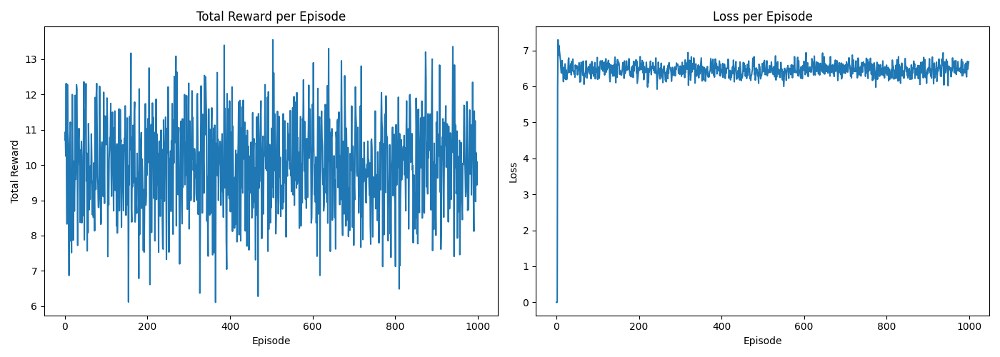

# Algorithm Optimizer

This project aims to optimize Python code algorithms using a neural network trained with reinforcement learning. The neural network predicts and removes unnecessary nodes in the abstract syntax tree (AST) of the code, such as redundant functions, imports, assignments, and comments longer than 40 characters.



## Features

- **Neural Network Model**: A deep neural network with multiple layers and neurons to predict code optimizations.
- **Reinforcement Learning**: The model is trained using reinforcement learning techniques with experience replay memory.
- **GPU Acceleration**: The training process utilizes GPU acceleration for improved performance.
- **Code Optimization**: The trained model optimizes Python code by removing unnecessary nodes and ensuring comments are not longer than 40 characters.

## Requirements

- Python 3.6+
- PyTorch
- NumPy
- astunparse

## Installation

1. Clone the repository:
    ```bash
    git clone https://github.com/shrimo/algorithm-optimizer.git
    cd algorithm-optimizer
    ```

2. Install the required packages:
    ```bash
    pip install torch numpy astunparse
    ```

## Usage

### Training the Model

To train the model, run the `train.py` script. This will train the neural network using reinforcement learning techniques and save the trained model to `algorithm_optimizer.pth`.

```bash
python train.py
```

To optimize a Python script, use the `optimizer.py` script with the path to the Python file you want to optimize as an argument.

```bash
python optimizer.py <path_to_python_file>
```

For example:
```bash
python optimizer.py example.py
```

This will optimize the provided Python file by removing unnecessary AST nodes and comments longer than 40 characters, and save the optimized code back to the file.

## Detailed Example

Let's say you have a Python script `example.py` with the following content:

```python
# This is a very long comment that exceeds forty characters.
import os
import sys

def sample_function():
    # Another long comment that needs to be shortened or removed.
    x = 10
    y = 20
    return x + y
```

After running the optimizer:
```bash
python optimizer.py example.py
```

The `example.py` script might be optimized to:

```python
import os
import sys

def sample_function():
    x = 10
    y = 20
    return x + y
```
Comments longer than 40 characters are shortened or removed, and unnecessary nodes are optimized.

## License
This project is licensed under the MIT License. See the LICENSE file for details.
